% Lecture #1: Basics of the physics behind Magnetic Resonance Imaging (MRI)
% R. Cameron Craddock, PhD
  Research Scientist VI, Nathan S. Kline Institute for Psychiatric Research, New York, NY
  Director of Imaging, Child Mind Institute, New York, NY
% July 28, 2014

---

# The Human Connectome

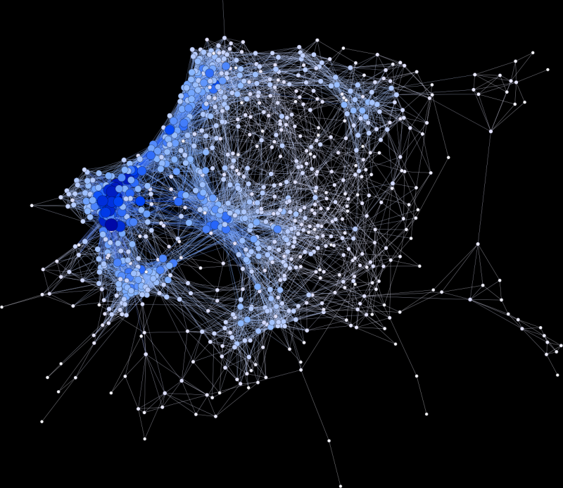

- A map of all of the connections in the human brain - nodes, structural connections, and functional interactions
- Nodes are brain areas that are thought to be homogenous brain areas
- Structural connections refer to anatomical connections between regions - axons, fiber pathways
- Functional interactions are inferred from synchornization in phsyiological measures of brain activity

---

# Macroconnectomics

- The connectome can be measured at different scales, from the microscale that is concerned with cells and axons, up to the macroscale which involves patches of cortex with 1000s of cells, and large fiber pathways
- The macroscale is most accessible due to non-invasive imaging methods
- It also makes most since because it maps best to the resolution to which we understand brain function
- Magnetic resonance imaging (MRI), diffusion MRI, and funcitonal MRI have become the most commonly employed tools based on availability, safety, and temporal and spatial resolution

---

# Magnetism

- **Magnetism** is a force exerted by magnets, or moving electric charge, on other magnets
- **Magnets** are materials or objects that produce magnetic fields
- Magnets only exist as **dipoles**, with north and south poles, similar poles of different magnets repel one another, opposite poles attract

---

# Magnetic Field

- A **Magnetic Field** describes the influence of a magnet on its surroundings
- **Maxwell's correction to Ampère's law** - A changing electric field, such as a current through a loop of wire, will generate a magnetic field (**Electromagnet**)
- **Faraday's Law** - A changing magnetic field, such as through a conductor, generates an electric field, that will drive a current in that conductor (**Receiver Coil**)
- **Lenz's Law** - The generated current will flow in a direction to generate a magnetic field which *opposes* the applied field

---  

# Magnetic Susceptibility

- **Magnetic Susceptibility** ($\chi$) indicates the degree to which a material becomes magnetized ($\mathbf{B}$) in response to a magnetic field ($\mathbf{H}$): $\mathbf{B}\propto(1+\chi)\mathbf{H}$
- **Paramagnetism** ($\chi>0$): the material increases the magnetic field
- **Diamagnetism** ($\chi<0$): the material decreases the magnetic field
- **Ferromagnetism**: the material has a magnetic field independent of an applied field
- Areas of transition between different magnetic susceptibilities result in distortions to the magnetic field

---

# Magnetic Moments of Atoms

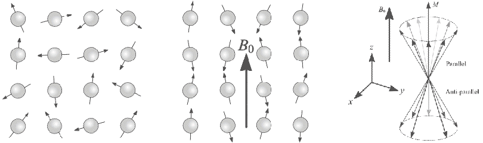

- Atoms have "spin" that imparts a **magnetic moment ($\mu$)** - spinning charge generates a magnetic field
- Without an external magnetic field, the atoms have random orientations, and the magnetic moments cancel each other out
- An external magnetic field ($B_0$) applies torque to the atoms to align them with the magnetic field
- Due to thermal processes, only a slight majority of atoms align parallel to the external field ($N^+$), the others align anti-parallel ($N^-$) and the difference results in a net magnetization aligned with the external field
- At room temperature, for a magnet strength of 1 Tesla, $(N^{+}-N^{-})/N = 3 \times 10^{-6}$ !! 

---

# Precession

- Spin also imparts **angular momentum** to the atom, which makes it precess around the axis of $B_0$
- The frequency of precession is the **Larmor Frequency**, $\omega=\gamma T \frac{rad}{s}$, $f=\bar{\gamma} T \: Hz$ 
- $\gamma$ is the **gyromagnetic ratio** which for Hydrogen: $\gamma = 267.513 \times 10^6 \frac{rad}{s T}, \bar{\gamma}=\frac{\gamma}{2\pi}=42.576\frac{MHz}{T}$
- When atoms precess in synchrony, their is a net magnetization in the x-y (transverse) plane that rotates with $\omega$
- Once atoms are out-of-phase, the net magnetization in x-y plane goes to zero 

---

# Flipping Spins

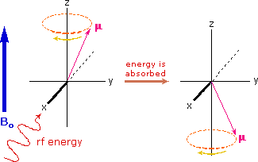

- The angle of precession can be changed by applying a time-changing magnetic field, that is oscillating at the Larmor frequency (**RF pulse**)
- The bandwidth of the RF pulse determines the types of spins that will be flipped 
- The magnitude and duration of the RF pulse determine the **flip angle**
- This has the effect of synchronizing all spins, so that their is a net magnetization in the x-y plane

---

# Relaxation

    <iframe width="300" height="225" src="http://www.youtube.com/embed/lKp67IqQjH4" frameborder="0" allowfullscreen></iframe>
    <iframe width="300" height="225" src="http://www.youtube.com/embed/is8TscwFOvM" frameborder="0" allowfullscreen></iframe>
    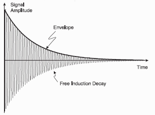

- Once spins have been tipped by a RF pulse, they will eventually return to alignment with $B_0$ in a process called **Longitudinal (or Spin-Lattice) Relaxation**
- The time it takes for the spins to fully relax ($T_1$) is determined by the molecular environment of the spins
- Additionally, the speed of precession for neighboring spins will not all be the same, and they will eventually fan-out, resulting in a zero net-magnetization in the x-y plane, in a process called **Transverse (or Spin-Spin) Relaxation**
- The time it takes for the spins to fully de-phase is specified by $T_{2}^{*}=T_{2}+T_{2}^{'}$
    - $T_{2}$ is due to molecular motion (diffusion) of the spins
    - $T_{2}^{'}$ is due to variations in the magnetic field

---

# Measuring Spins

- Once flipped into the x-y plane, the changing magnetic field produced by precessing spins can be detected using a coil placed perpendicular to the main external field ($B_0$ field)
- The changing magnetic field will induce a current into the coil (Faraday's Law)

---

# Nuclear Magnetic Resonance Spectroscopy

- The signal generated by each spinning atom will oscillate at its Larmor frequency
- The measured signal is a summation of all of the signals from the different spins in a sample

- Using a Fourier transform, the different frequency components of a signal can be determined, along with the relative amount of power in each frequency
- This provides information about the type and quantity of the different atoms in the sample

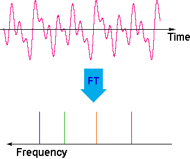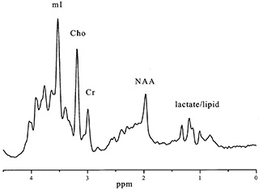

---

# Magnetic Resonance Imaging 

- Magnetic resonance imaging focuses solely on NMR of Hydrogen (protons)
    - One of the most abundant elements in the human body
    - Spin 1/2, simplifies the physics
    
- Spatial encoding can be accomplished by spatially-varying magnetic fields (**gradients**)
- Results in frequency encoding of spatial information, frequency of proton spin can be used to determine its location

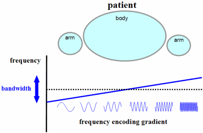

---

# K-Space

- The representation formed by frequency encoding the spatial information of an image is called **K-space**
- By varying the timing of signal acquisition and the sequence of gradients used, all of k-space can be sampled in ether 2D or in 3D, and Fourier Transforms applied to the data will produce an image

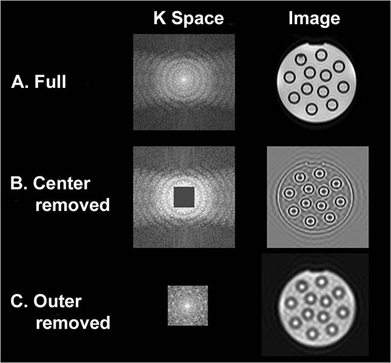

---

# MRI Sequences

- Different imaging contrasts and modalities can be created by changing the timing and ordering of RF and Gradient pulses

    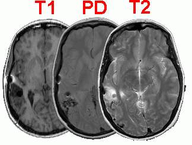
    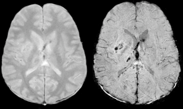
    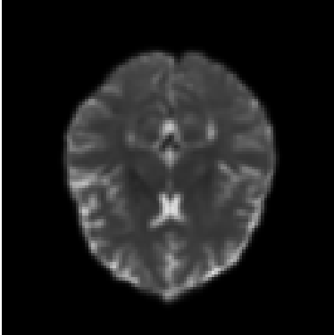

---

# Gradient Echo

- The simplest sequence is a Fast Low Angle SHot (FLASH), gradient echo sequence 
- A gradient applied in the Z-direction during RF excitation permits a specific slice to be selected
- A **phase encoding** gradient pulse in the Y-direction moves a line in the Y direction into range
- A **gradient recalled echo (GRE)** readout generates an echo centered in the readout window

    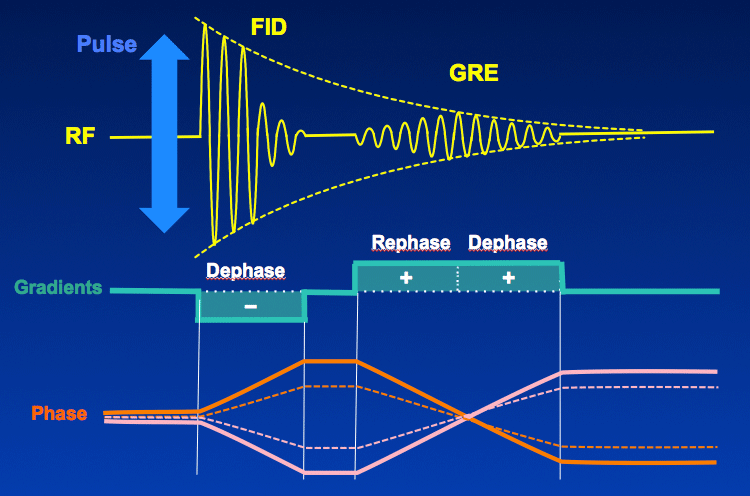

---

# Echo Planar Imaging

    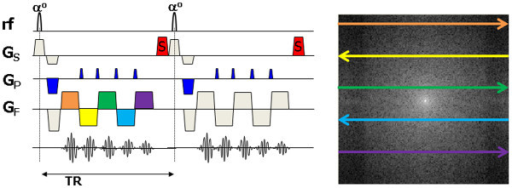

- By extending the train of readout gradients and including more phase encoding blips, it is possible to raster through the entire K-space for a 2-D slice

    

---

# Spin Echo

    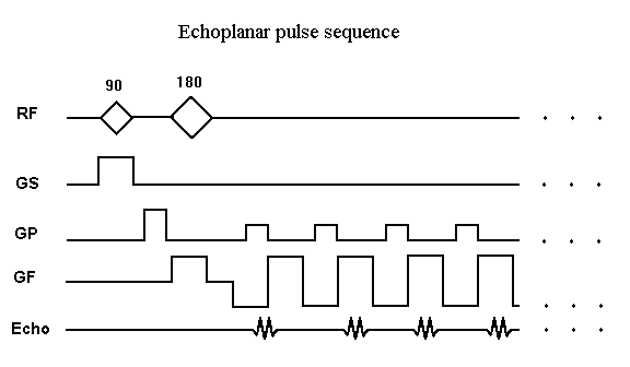<iframe  width="400" height="225" src="http://www.youtube.com/embed/dFp2Z3wjrmo?list=PLCD41685D8499AAB1" frameborder="0" allowfullscreen></iframe>

- Adding a $180^\circ$ RF pulse, refocuses dephasing due to $T_{2}^{'}$ to achieve pure $T_{2}$ images
    
    
---
    
# Magnetization Preparation

    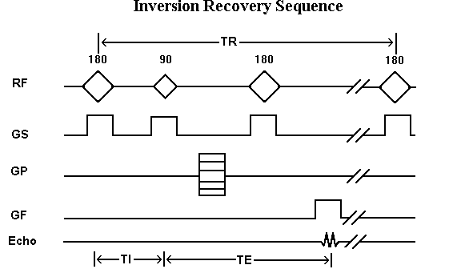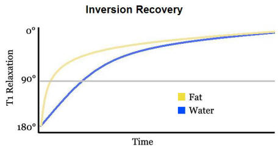

- Adding an **inversion pulse** prior to excitation provides extra flexibility for nulling unwanted signal (here water) or enhancing image contrast 

    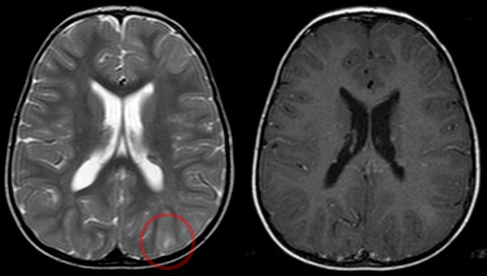

- This technique is useful for removing bright CSF signal from $T_2$ images (FLAIR)

---

# Imaging Parameters

- **Flip Angle** - The amount of flip performed by the excitation pulse, sets the limit for signal available in the transverse plane
- $\mathbf{T_{I}}$ - The amount of time between inversion pulse and excitation, determines contrast enhancement and nulling
- $\mathbf{T_{E}}$ - Echo time, the time between excitation and readout, determines contrast, and amount of relaxation experienced by the image ($T_2$ weighting)
- $\mathbf{T_{R}}$ - Repetition time, the amount of time between repeating the sequence, determines the amount of signal available for successive excitations
- **Bandwidth** - the span of frequencies that are allocated to a single voxel, specified by the desired resolution and the gradient strength
- **Field of View** - specifies the size of the space to be imaged
- **Voxel Resolution** - specifies the size of each imaging element, determines the amount of signal available

---

# MRI System

    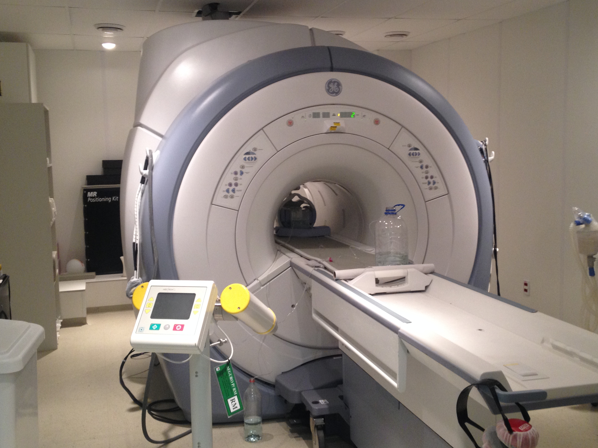
    

---

# MRI System - Gradients

    

---

# MRI System - Bore

    

---

# MRI System - Coils

    

---

# MRI System

    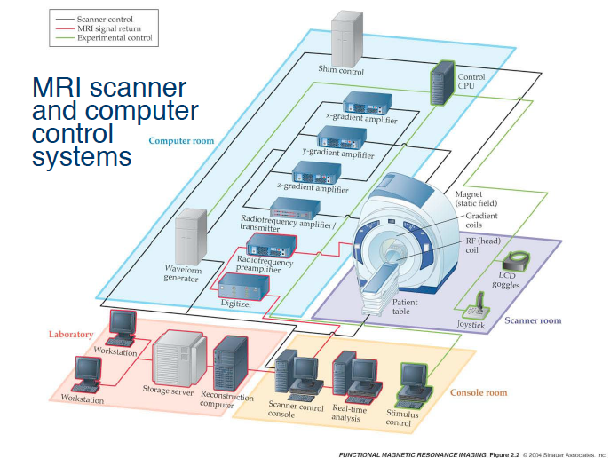

